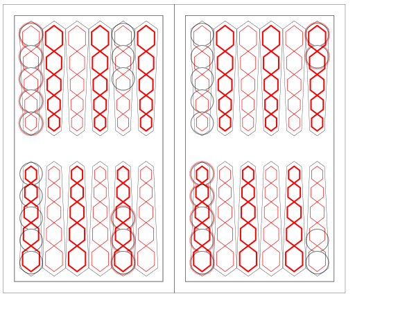

# Backgammon board (laser-cut SVG)

Parametric generator for a full-size, open-layout backgammon board as an Inkscape-compatible SVG. The board is sized for **32 mm checkers** by default and is intended for laser cutting: red strokes mark etch geometry, black strokes mark cut geometry.

## Quick start

Requires Python 3.10+.

```bash
# with uv (recommended)
uv sync
uv run build-bg-board

# or pip
python -m venv .venv
source .venv/bin/activate
pip install -e .
build-bg-board
```

Default output is `backgammon_board.svg` in the project root.

### Bash tab completion

After `uv sync`, load completions in the current shell:

```bash
source completions/install.sh
```

To install permanently:

```bash
./completions/install.sh --persist
source ~/.bashrc
```

Then `build-bg-board` and `build-hex-rosette` complete flags and file paths (e.g. `--out`, `--output`).

## CLI

```bash
build-bg-board --help
```

| Option | Default | Description |
|--------|---------|-------------|
| `--out PATH` | `backgammon_board.svg` | Output SVG path |
| `--checker-size MM` | `32` | Checker diameter; scales the whole board proportionally |
| `--template-margin MM` | `0.5` | Expansion around checker stacks in the template layer (at default checker scale) |
| `--template-arc-ratio RATIO` | `1/6` | Horizontal arc inset for template outlines, as a fraction of checker size |
| `--rosette` | off | Add a 21-set hex rosette centered in each playing half |
| `--rosette-ratio RATIO` | `1` | With `--rosette`, set diameter as a checker-size ratio; values above 1 expand board height by the excess diameter |

Example — regenerate at default scale:

```bash
uv run build-bg-board --out backgammon_board.svg
```

At the default checker size the canvas is **600 × 450 mm**.

Use a larger rosette while preserving clearance between the opposing pip and
checker layouts:

```bash
uv run build-bg-board --rosette --rosette-ratio 2
```

## Output layers

The generator writes Inkscape layers (`inkscape:groupmode="layer"`). Configure your laser job per layer and/or stroke color.

| Layer ID | Label | Stroke | Laser use | Contents |
|----------|-------|--------|-----------|----------|
| `layer1` | Pip Etch | red | Etch | 24 pip units (5 red nested hex rings each) |
| `layer3` | Pip Cut | black | Cut | 24 pip units (black pip outline each) |
| `layer4` | Checkers | black | Reference / optional cut | 30 circles at standard starting positions |
| `layer5` | Border | black | Cut | Inner and outer frames for both player halves |
| `layer6` | Checker Template | black/red | Cut/etch (jig) | Per-stack cut outlines, black-checker etch rings, and inset inner-border rects |

**Production board:** hide or omit `layer4` (checker reference) and `layer6` (placement jig). Use `layer1` for pip etch and `layer3` for pip cut.

Red etch hex paths live on `layer1` (Pip Etch); black pip cut outlines live on `layer3` (Pip Cut). Each layer has matching per-pip groups with the same transforms.

## Board layout

- **24 pips** — 12 on the top half (pointing down) and 12 on the bottom half (pointing up), in standard open-board orientation.
- **Pip geometry** — five nested hexagonal checker-seat rings (etch) plus a triangular pip outline (cut), derived from the v2 board design and embedded in `build_bg_board.py`.
- **Borders** — computed from pip bounding boxes:
  - Inner frame inset: `checker_size / 4` from pip extents
  - Outer frame inset: `checker_size / 2` from the inner frame
  - At 32 mm checkers that is **8 mm** inner and **16 mm** outer clearance
- **Center bar** — the gap between left and right six-pip groups within each half is set by positioning the right group so its inner border touches the left group's inner border (32 mm total at default scale).

### Starting checker positions (`layer4`)

Eight stacks, 30 checkers total (standard 15 per player):

| Board side | Pip index | Checkers |
|------------|-----------|----------|
| top | 1 | 5 |
| top | 5 | 3 |
| top | 7 | 5 |
| top | 12 | 2 |
| bottom | 1 | 5 |
| bottom | 5 | 3 |
| bottom | 7 | 5 |
| bottom | 12 | 2 |

Checker centers are placed tangent to each pip's flat base, then stacked at one checker diameter apart. Layout is verified at build time by `verify_checker_layout()`.

### Checker template (`layer6`)

Optional jig layer: expanded cut outlines around each starting stack plus inset
rectangles matching the inner playing-area borders. Stacks on black starting
pips 6, 8, 13, and 24 also receive two red etch outlines, spaced 1 mm and 2 mm
outside the cut outline for 32 mm checkers. These offsets scale with
`--checker-size`. Tune the cut outlines with `--template-margin` and
`--template-arc-ratio`.

## Project files

| File | Role |
|------|------|
| `build_bg_board.py` | Generator (also importable; entry point `build-bg-board`) |
| `pyproject.toml` | Package metadata and dependencies (`svgwrite`) |
| `backgammon_board.svg` | Generated deliverable (re-run the CLI to refresh) |
| `hex_pip.svg` | Original single-pip Inkscape source (reference) |
| `backgammon_board_v2_scripted.svg` | Hand-authored reference the generator recreates |
| `backgammon_board_v2.dxf` | DXF export of the v2 design |

## Development

```bash
# run directly
uv run python build_bg_board.py --checker-size 32

# or as a module after editable install
python -m build_bg_board
```

The generator uses [svgwrite](https://github.com/mozman/svgwrite) and encodes pip path data and placement transforms from `backgammon_board_v2_scripted.svg` rather than parsing `hex_pip.svg` at build time.

## Preview



## Design notes

- Scaling is uniform: `--checker-size` multiplies all geometry and the canvas via `scale_factor(checker_size / 32)`.
- Stroke width is fixed at **0.301517 mm** with `vector-effect: non-scaling-stroke`.
- By default, adjacent pip etches alternate between `--pip-engrave-width` and
  one-third of that width. The top and bottom rows use opposite parity so
  vertically opposing pips have different weights. Use `--no-alternate-pips`
  for uniform etches. In cut mode the red pip etches alternate, but the black
  cut outlines retain their normal centerline width; in no-cut mode the red
  replacement outlines alternate with the other pip etches.
